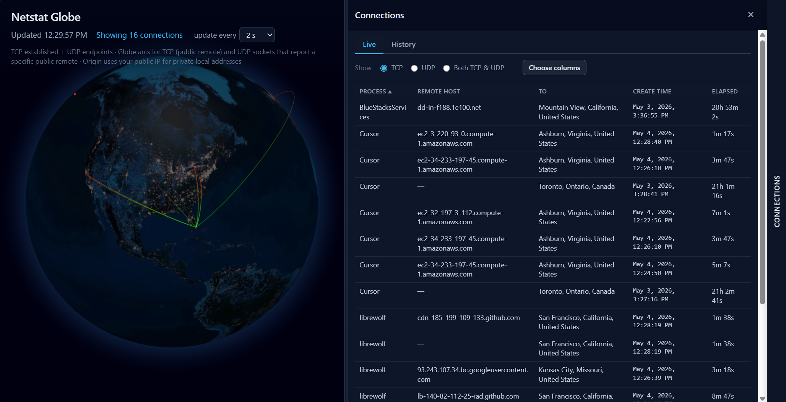

# Netstat Globe

Real-time network connections on a 3D globe. A small Node.js server polls your OS for active TCP/UDP sockets, geolocates public remote IPs, and streams updates to a web UI over WebSocket.



## Features

- Live **TCP Established** connections + **UDP endpoints**
- **3D globe** visualization with arcs
- Connection **drawer** with **Live**, **History**, and **Settings** tabs
- **Live search** across process, local, remote, remote host, from, and to (saved in the browser)
- **Highlight & notification rules** — color matching arcs on the globe, show a colored dot on matching live rows, and optional browser notifications
- Connection **drawer** with sorting, protocol filters, column picker, copy-to-clipboard
- **Ctrl+click** Local/Remote/Remote Host to open a WHOIS lookup
- Hover a globe arc or live table row to link-highlight both (uses the rule color when a rule matches)
- Works on **Windows, Linux, macOS**

## Settings

Open the connections drawer and select the **Settings** tab.

### Update frequency

Choose how often the server polls for new connections (0.5 s–30 s). The choice is remembered in your browser and sent to the server over WebSocket.

### Highlight & notification rules

Create one or more rules. Each rule has:

| Field | Description |
|--------|-------------|
| **Label** | Name used in browser notifications (e.g. `Spain`) |
| **Highlight** | Color for matching globe arcs and the dot in the live table |
| **Notifications** | Disabled, or **Web browser notification** when a new matching connection appears |
| **Filter by** | Remote IP address, Remote hostname, Remote location, or **Ad Tracker List** |
| **Filter** | See [Filter syntax](#filter-syntax) below |

- Rules are stored in **localStorage** in the browser.
- **Add rule** is enabled once the current rule’s filter is filled in (for Ad Tracker List, the list must finish loading).
- Rule cards are defined in an HTML `<template>` in `public/index.html` (`#settings-rule-template`) so you can adjust layout without changing all of the JavaScript.

#### Filter syntax

Filters are a **comma-separated list** of expressions. A connection matches if **any** expression matches.

**Regular expressions (all filter types)**  
Wrap the pattern in slashes; matching is always **case-insensitive**:

```text
/google/
.*\.amazonaws\.com
```

**Remote hostname / Remote location (non-regex)**

- Plain text: substring match (case-insensitive)
- `*` wildcard: matches one or more characters (e.g. `spa*in`)

**Remote IP address (non-regex)**

- Single address: `180.92.1.177`
- Range: `180.92.1.1-180.92.1.255`
- Wildcard: `180.92.*` (prefix by octet; `*` matches remaining octets)
- CIDR: `180.92.1.0/24`

**Ad Tracker List**

- Pick a hosted block list (e.g. EasyList). The app loads domains from the list and matches **remote hostnames** (including subdomain suffixes).
- Lists are fetched via the server proxy `GET /api/blocklist/:id` when the browser cannot load the upstream URL directly (CORS).

#### Browser notifications

- Fires only when a **new** matching connection appears (not on every poll).
- At most **one notification every 10 seconds**, with counts aggregated in that window.
- One rule matched:  
  `3 new connections were made matching rule: "Spain".`
- Several rules matched:  
  `5 new connections were made matching several network notification rules.`
- Permission is requested when you enable notifications on a rule.

## Requirements

- Node.js **18+**
- OS tools:
  - **Windows**: PowerShell + `Get-NetTCPConnection` / `Get-NetUDPEndpoint` (built-in)
  - **Linux**: prefers `lsof` if installed; falls back to `ss` (`iproute2`) when `lsof` is missing
  - **macOS**: `lsof` (ships with macOS)

## Install

```bash
npm install
```

## Run

```bash
npm start
```

Then open:

- App: `http://localhost:3847/`
- Debug page: `http://localhost:3847/debug`

### Choose a different port

- macOS/Linux:

```bash
PORT=3848 npm start
```

- Windows (cmd):

```bat
set PORT=3848 && npm start
```

## Restart (kill old process on same port)

If you have a leftover instance still listening on the port:

```bash
npm run restart
```

This runs `free-port.js` (kills the process listening on `PORT`) and then starts the server.

## API (debug / integrations)

| Endpoint | Description |
|----------|-------------|
| `/api/health` | Server status, last broadcast, WebSocket client count |
| `/api/raw-tcp` | Raw TCP/UDP from the OS (no geo) |
| `/api/snapshot` | Cached JSON snapshot (same as WebSocket) |
| `/api/snapshot?live=1` | Force a fresh snapshot |
| `/api/blocklist/:id` | Proxy for ad-block filter lists (e.g. `easylist.to`) |

## Notes / Troubleshooting

- **Linux without `lsof`**: install one of these
  - `lsof` (recommended): `sudo apt install lsof` / `sudo yum install lsof` / `sudo apk add lsof`
  - `ss` via iproute2: `sudo apt install iproute2`
- **Permissions on Linux**: `ss -p` and `lsof` may not show process names for sockets you don’t own unless you run with elevated privileges.
- **Geo lookups**: the server uses `ip-api.com` to geolocate public IPs and caches results in memory.
- **WebGL**: if the globe does not render, the live/history tables still work; check browser WebGL support at [get.webgl.org](https://get.webgl.org/).
- **Browser notifications**: must be allowed for this site; blocked sites show a hint in Settings.
